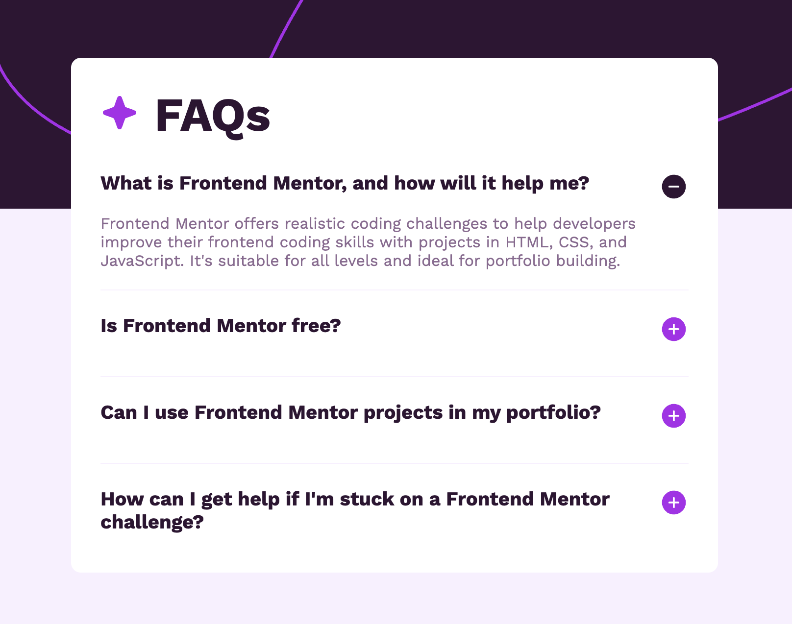

# Frontend Mentor - FAQ accordion solution

This is a solution to the [FAQ accordion challenge on Frontend Mentor](https://www.frontendmentor.io/challenges/faq-accordion-wyfFdeBwBz). Frontend Mentor challenges help you improve your coding skills by building realistic projects.

## Table of contents

- [Overview](#overview)
  - [The challenge](#the-challenge)
  - [Screenshot](#screenshot)
  - [Links](#links)
- [My process](#my-process)
  - [Built with](#built-with)
  - [What I learned](#what-i-learned)

## Overview

Your challenge is to build out this FAQ accordion and get it looking as close to the design as possible.

### The challenge

Users should be able to:

- Hide/Show the answer to a question when the question is clicked
- Navigate the questions and hide/show answers using keyboard navigation alone
- View the optimal layout for the interface depending on their device's screen size
- See hover and focus states for all interactive elements on the page

### Screenshot




### Links

- Solution URL: https://github.com/SurajChaunal/frontend-mentor-FAQ-component.git
- Live Site URL: https://surajchaunal.github.io/frontend-mentor-FAQ-component/

### Built with

- Semantic HTML5 markup
- CSS custom properties
- Flexbox
- CSS Grid
- Mobile-first workflow
- Vanilla Js

### What I learned

in this challenge i mainly improved my responsiveness by using clamp function for fonts and also using max-height and opacity to hide and element smoothly instead of using display = none.

```css
max-height: 0;
overflow: hidden;
transition: max-height 0.3s ease;
```

```js event delegation
if (!e.target.closest(".question-container")) return;
```
